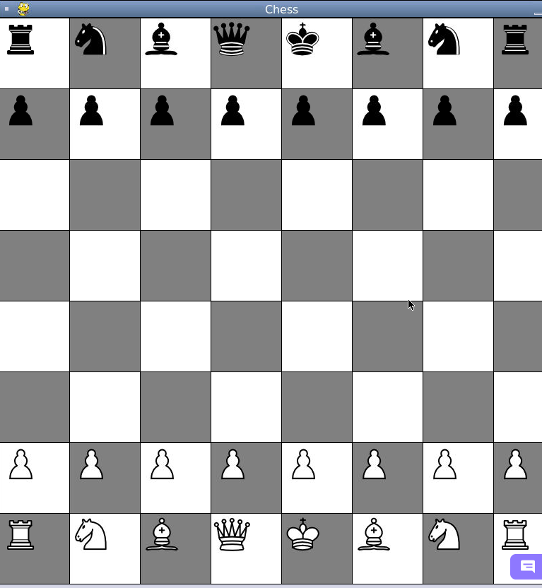
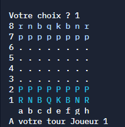
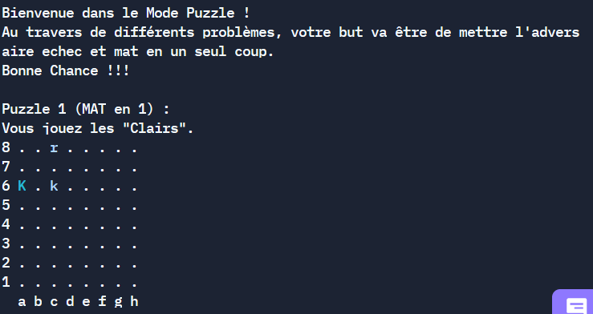

# Polychess
## Objectives :

We want to create a fully fonctionnal chess game in console mode and in UI mode.
We also want to add a little game to add some fun.

## Requierments : 
To play this game, you wil need Python 3.7 or higher.

We use 2 Pypi packages : 
- chess version 1.8.0 or higher
- pygame version 2.1.0 or higher

You can download all the requiered packages with the command :   
`pip install -r requirements.txt`

## How to Play : 

### How to launch the game
To launch the game, you need to launch the 'main.py' file with this command : 

`python3 src/main.py`

### Graphical Mode
This mode is not entirely finished : 
- The pawn change at the opposite side of the board is not yet implemented
- The AI is not fully integrated

You are presented with a board like this one :

You can then choose 

### Console Mode : 
When you play in console mode you have 2 choices :
- Play against another play (PvP)
- Play agains the AI (PvE)

And you are presented with this kind of board : 

Player 1 plays as the cyan team and Player 2 plays as the sky blue team.

You will need to choose at first the piece that you wish to move, then position you wish to move this piece.

### Puzzle Mode : 

In the Puzzle mode you will need to find the best move to put your oponent in checkmate. 

 

## Development : 
The development began the 16th of January of 2021
### Session 1 (16/12/2021)

The team got familiar with python-chess 

### Session 2 (04/01/2022)

- Main game loop created.
- PvP play in console partialy finished, only the checkmate needs to be implemented, as well as the pawn change at the other end of the board. 
- We can now display the game board on the screen.

### Session 3 (05/01/2022)

- Checkmate and pawn change in console mode are now supported. 
- All the pieces are now displayed and movable on the graphical board.
- An AI has been implemented in console mode

## Session 4 (10/01/2022)

- We corrected the console mode
- We added 4 AI difficulties : "Easy", "Normal", "Hard" and "Expert"
- Refactoring the code
- Puzzle mode added

## Session 5 (12/01/2022)

- We did some refactoring
- We added some comments too in order to make it more readable
- Not really an accomplishment, but we kinda broke the AI for the grafical mode, so the current version isn't really functional